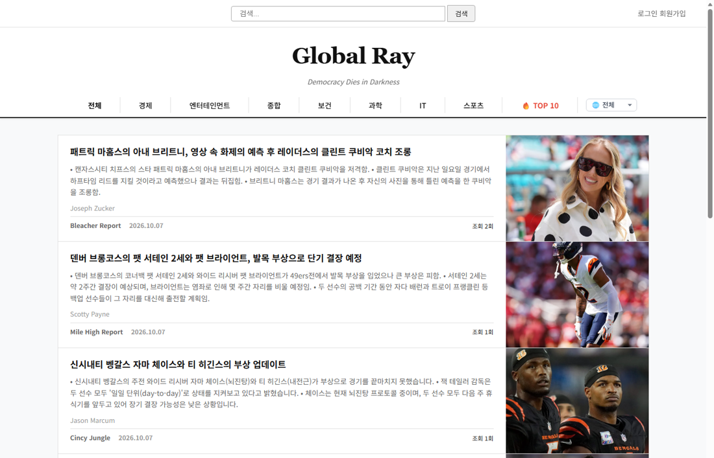
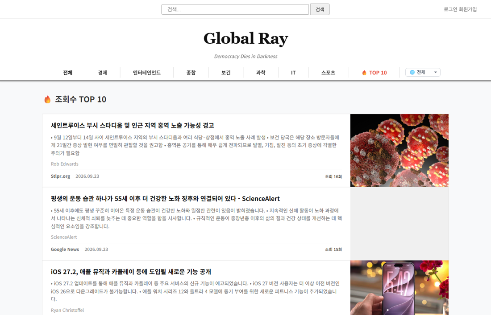
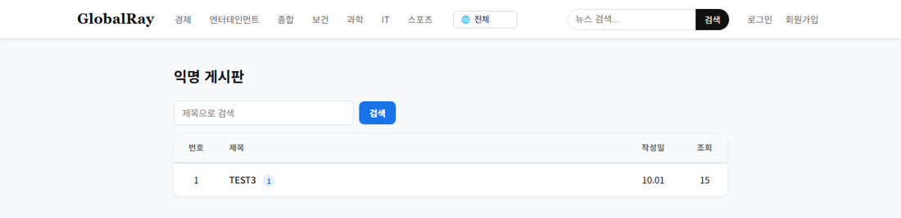
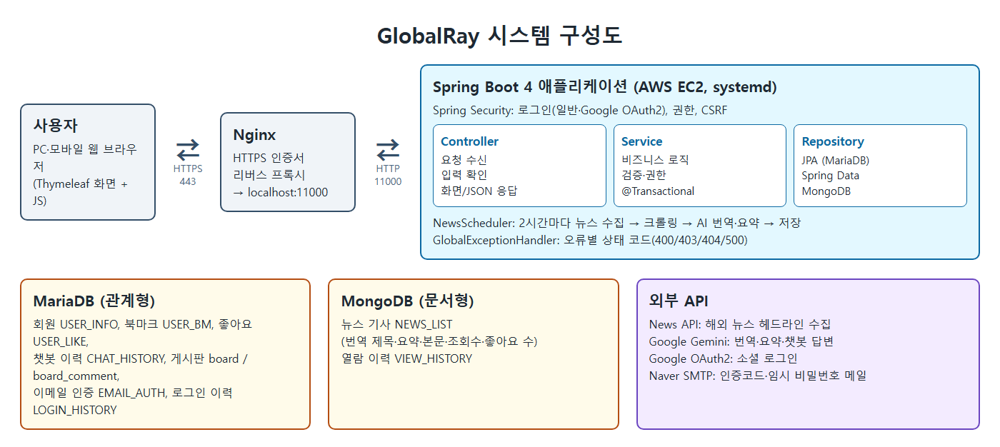
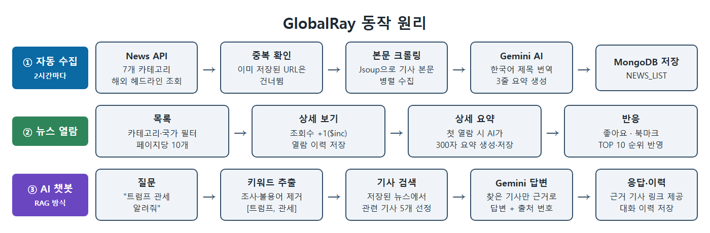
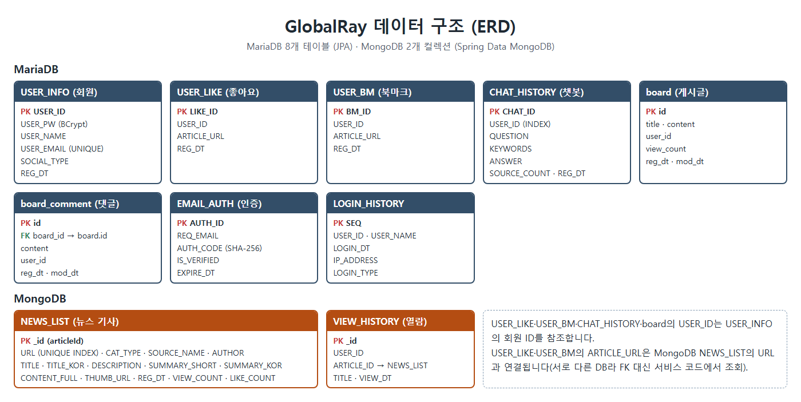

# 🌏 Global Ray

> 해외 주요 언론사 뉴스를 자동으로 수집하고, AI로 한국어 번역·요약해 보여주는 뉴스 플랫폼

**배포 주소** : https://globalray.kr

영어 기사를 직접 읽기 어려운 사용자도 세계 뉴스를 빠르게 파악할 수 있도록 만든 개인 졸업작품입니다.
2시간마다 해외 헤드라인을 수집해 한국어 제목과 3줄 요약을 만들고, 저장된 뉴스만 근거로 답하는 AI 챗봇을 제공합니다.

<p align="center">
  
</p>

---

## 주요 기능

### 기본 기능
| 기능 | 설명 |
|---|---|
| 뉴스 자동 수집·번역 | 2시간마다 7개 카테고리 해외 뉴스 수집 → 본문 크롤링 → AI 한국어 제목·3줄 요약 |
| 뉴스 목록·검색 | 카테고리별 목록, 페이징, 한국어 제목 검색 |
| AI 상세 요약 | 기사를 처음 열람할 때 300자 상세 요약을 생성해 저장 |
| 회원 | 이메일 인증 회원가입, 일반·Google 로그인, 아이디·비밀번호 찾기, 마이페이지 |
| 북마크 | 관심 기사 저장 및 마이페이지에서 모아보기 |
| 관리자 | 회원 목록, 로그인 이력, 기사 열람 이력 조회 |

### 추가 기능
| 기능 | 대표 API | 구현 포인트 |
|---|---|---|
| 뉴스 좋아요 | `POST /like/toggle` | 토글 방식, MongoDB `$inc`로 좋아요 수 원자적 증감, 비로그인 시 401 |
| 국가별 필터 | `GET /news/{category}?country=US` | 언론사-국가 대응표로 변환 후 `$in` 쿼리로 서버에서 필터링·페이징 |
| 조회수·TOP 10 | `GET /news/detail/{id}`, `GET /news/top10` | 상세 진입 시 조회수 증가 + 열람 이력 저장, 조회수 순 10개 |
| AI 챗봇 (RAG) | `POST /chatbot/ask` | 질문 키워드 추출 → 저장된 기사 검색·점수화 → 그 기사만 근거로 Gemini 답변 |
| 익명 게시판 | `GET /board`, `POST /board/write` | 글·댓글 CRUD, 제목 검색, 작성자만 수정·삭제(서버에서 권한 검사, 403) |

<p align="center">
  
  
</p>

---

## 기술 스택

| 구분 | 기술 |
|---|---|
| Backend | Java 17, Spring Boot 4.0.5, Spring Security 7, Spring Data JPA, Spring Data MongoDB |
| Frontend | Thymeleaf, JavaScript, HTML/CSS |
| Database | MariaDB (회원·게시판 등 정형 데이터), MongoDB (뉴스 기사·열람 이력) |
| External API | News API, Google Gemini API, Google OAuth2, Naver SMTP |
| Library | Jsoup (본문 크롤링), Lombok |
| Infra | AWS EC2 (Ubuntu), Nginx (HTTPS 리버스 프록시), systemd |
| Tools | IntelliJ IDEA, Gradle, Git / GitHub |

---

## 시스템 구성



### 동작 흐름



### 데이터 구조



---

## 프로젝트 구조

```
src/main/java/kopo/poly/globalray
├── batch        # NewsScheduler - 2시간마다 뉴스 수집
├── config       # SecurityConfig(권한·CSRF·로그인), GlobalExceptionHandler(오류별 상태 코드)
├── controller   # 요청 수신·입력 확인·응답
├── service      # 서비스 인터페이스 (IxxxService)
│   └── impl     # 비즈니스 로직 구현 (xxxServiceImpl)
├── repository   # JPA / MongoDB Repository
├── entity       # DB 테이블·컬렉션 매핑
├── dto          # 화면·API 응답 객체 (Entity를 직접 노출하지 않음)
├── security     # 일반·Google 로그인 사용자 조회
├── exception    # NotFoundException
└── util         # SecurityUtil, CountryMapper, EncryptUtil, CmmUtil
```

---

## 설계 포인트

- **계층 분리** : Controller는 요청·응답만, 판단은 Service에서 처리하고 Service는 인터페이스와 구현체로 분리
- **용도에 맞는 DB 선택** : 관계가 명확한 회원·게시판은 MariaDB, 항목이 제각각인 뉴스 기사는 MongoDB
- **동시성** : 조회수·좋아요 수는 "읽고 +1 후 저장" 대신 MongoDB `$inc`로 DB가 직접 증감
- **오류 응답** : 없음 404, 권한 없음 403, 입력 오류 400, 서버 오류 500으로 구분해 응답
- **AI 장애 대응** : 챗봇의 AI 호출이 실패(사용량 초과 등)해도 검색된 관련 기사는 보여줌
- **보안**
  - 비밀번호 BCrypt 암호화, CSRF 토큰, URL별 접근 권한
  - 이메일 인증코드는 SHA-256으로 저장, 5분 만료, 5회 실패 시 잠금, 60초 재발송 제한
  - 게시글 수정·삭제는 화면 버튼과 별개로 서버에서 작성자 확인
  - 비밀값이 든 설정 파일은 Git에 올리지 않음

---

## 실행 방법

**필요 환경** : JDK 17, MariaDB, MongoDB, News API·Gemini API 키, Google OAuth2 클라이언트, 네이버 SMTP 계정

1. 설정 파일 만들기
   ```bash
   cp src/main/resources/application-template.yml src/main/resources/application.yml
   ```
   `application.yml`의 `YOUR_xxx` 값을 실제 값으로 바꿉니다. (이 파일은 `.gitignore`에 등록되어 커밋되지 않습니다.)

2. MariaDB에 `globalray` 데이터베이스 생성 (테이블은 JPA `ddl-auto: update`로 자동 생성)

3. 실행
   ```bash
   ./gradlew bootRun
   ```
   http://localhost:11000 에서 확인합니다.

4. 배포용 JAR 빌드
   ```bash
   ./gradlew bootJar
   ```

---

## 개발자

**배준수** · 한국폴리텍대학 서울강서캠퍼스 빅데이터소프트웨어과
